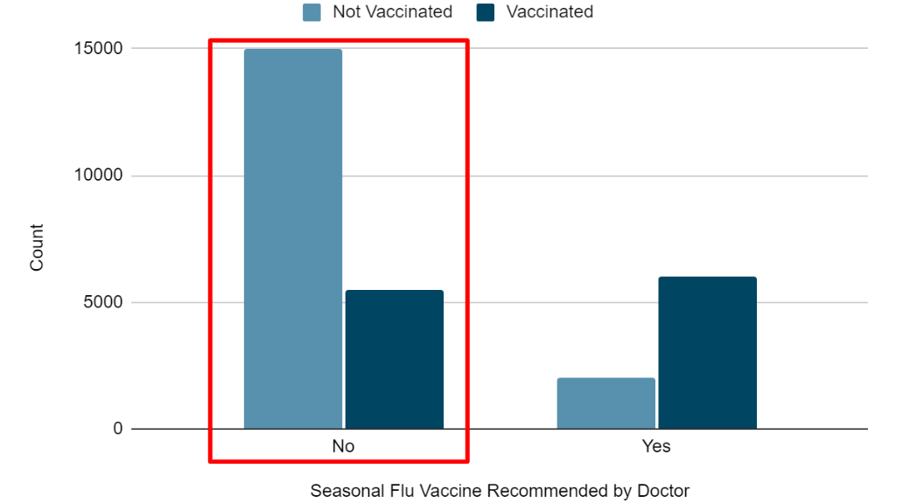
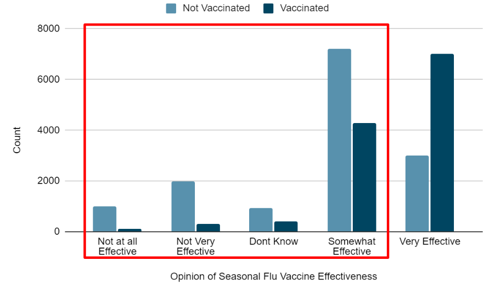
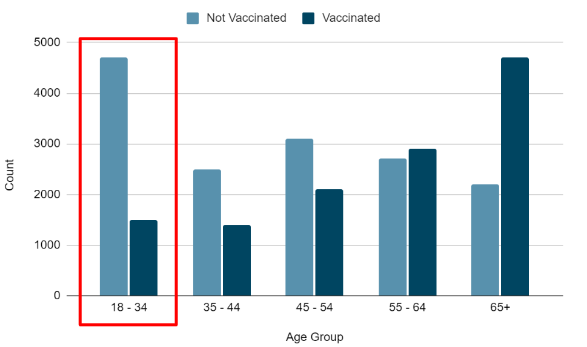
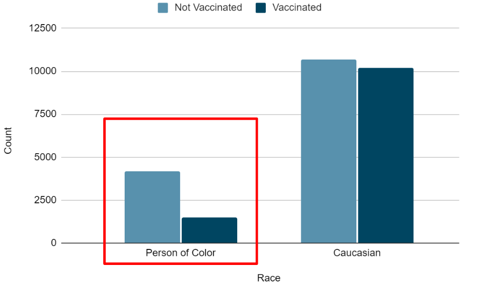

# Flu-Analysis

## Overview
This project aims to analyze Flu vaccination data from 2009-2010 from the National 2009 H1N1 Flu Survey. We hope to use this data to predict the likelihood of people getting the seasonal flu vaccine in the future.

## Business Problem

Getting the flu vaccine is crucial in protecting individuals and communities from the flu virus. However, understanding the factors which influence people's decisions can be very tricky. Our job was to look at the 2009 survey and try to predict the likelihood of a person getting the vaccine. By accurately identifying the individuals likely to get the vaccine, we can tailor our efforts to promote the flu vaccine and optimize the vaccination rate. We can also identify factors which would cause individuals to not get the vaccine and develop strategies to persuade them to participate in the vaccinations.

## Data Information

We obtained our data from the National 2009 H1N1 Flu Survey. There were 26,000 respondents to the survey. It included vaccination status for H1N1 Flu and the season flu, but for the purposes of this project, seasonal flu was used as the target. Since seasonal flu vaccinations was our target, we decided to drop all categories related to the H1N1 vaccine.

## Modeling

When creating our models, we decided to use precision as our main metric. We chose precison because we wanted to minimize the number of false positives, i.e the model saying someone got vaccinated when they actually didn't.  
First, we ran a model using the DummyClassifier class which predicted everyone got the vaccine. This resulted in a precision score of 49%.    
Next, we ran a LogisticRegression model using all of our seasonal flu vaccination predictors. This resulted in a precision score of 78%.  
We also tried to make a model using Decision Trees, but the highest precision score we could get was 74%.  
Since we were looking for the highest precision score, we chose LogisticRegression as our model.  
We tried tuning our LogisticRegression model using the top 5 most important features, but we could not improve the precision score so we decided to use all the features in our final model.

## Evaluation

Our initial LogisticRegression model had the highest precision score as well as the highest ROC AUC score of .8602 so this was clearly the model which had the best performance.
Based on the coefficients from our model, these were the 4 main predictors:
- Doctor Recommendation - doctors have a huge impact on whether people get vaccinated or not.  

  
  
- Opinion on Effectiveness - the majority of people who don't get the vaccine don't know how effective it is or don't believe it.

  
  
- Age group - people between 18-34 are the least likely to get the vaccine while people 65+ are the most likely

  
  
- Race - the main limitation of this dataset is that 79% of the respondents were white so this data is heavily biased towards caucasians.

  

## Conclusions

Based on the business problem and our data modeling, here are our recommendations to increase the number of people getting the seasonal flu vaccine:
- **Increase public awareness on effectiveness** - focus on educating the public on how effective vaccines are in preventing severe illness and hospitilization.
- **Encourage doctors to recommend vaccine** - emphasize to physicians the importance of discussing the vaccine with their patients
- **Target younger age groups and people of color** - focus on encouraging younger people to get the vaccine. Also, reach out to leaders in minority communities to spread the word about the importance of getting vaccinated.

-  ## For More Information

 Please refer to the [Jupyter notebook](./Flu_Analysis.ipynb) or the [presentation](./Flu_Analysis.pdf).

 If you have any questions, please contact our team:

 [Rajesh Reddy](https://github.com/rredd002)

 [Stuart Clark](https://github.com/sclarkHOU)

 [Steven Hui](https://github.com/xuqc01)

 ## Repository Structure

├── Data

├── images

├── Flu_Analysis.pdf

├── Flu_Analysis_notebook.ipynb

├── Flu_Analysis_notebook.pdf

├── README.md

├── gitignore.txt
